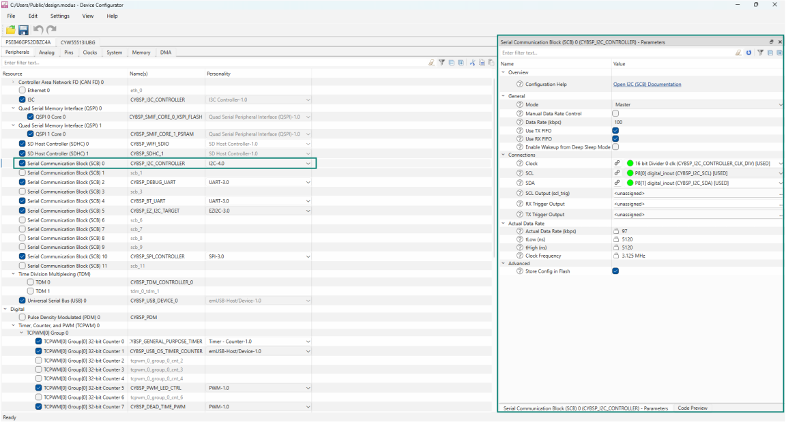
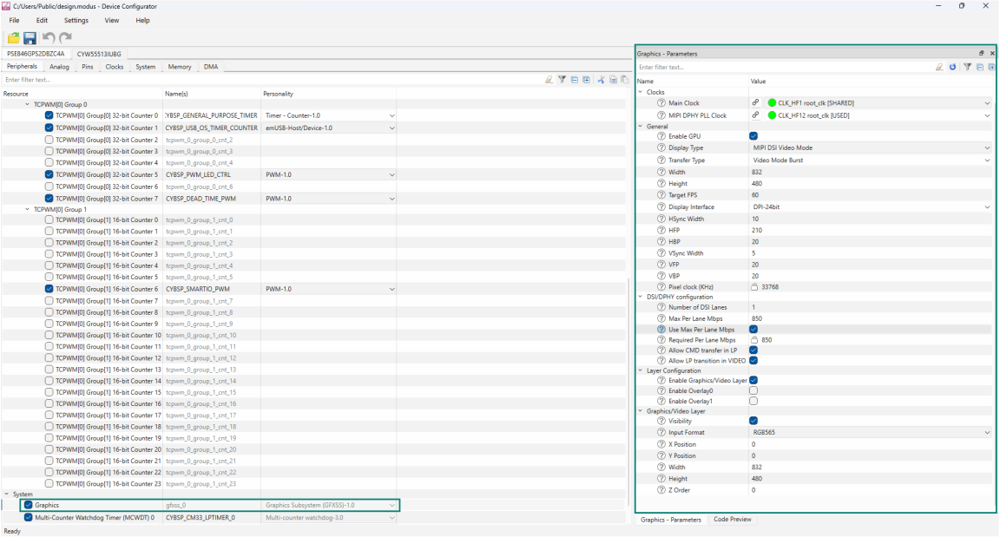

# Waveshare 4.3 inch DSI display driver library for ModusToolbox&trade;

## Overview

This driver library is designed to support a [Waveshare 4.3 inch DSI Capacitive Touch Display](https://www.waveshare.com/4.3inch-dsi-lcd.htm) on PSOC&trade; Edge E8x kits.

## Quick start

Follow these steps to add the driver in an application for PSOC&trade; Edge E8x Kit.

1. Create a [PSOC&trade; Edge MCU: Empty application](https://github.com/Infineon/mtb-example-psoc-edge-empty-app) by following "Create a new application" section in [AN235935 – Getting started with PSOC&trade; Edge E8 on ModusToolbox&trade; software](https://www.infineon.com/AN235935) application note

2. Add the *display-dsi-waveshare-4-3-lcd* library to this application using Library Manager

3. The Serial Communication Block (SCB) is configured as an I2C controller in the Device Configurator tool as follows:

   - Enable `Serial Communication Block (SCB)` resource and configure the same for display driver in the Device Configurator as shown in the following figure for the project created in **Step 1** <br>

     **Figure 1. SCB I2C master configuration in Device Configurator**

     

4. The graphics is configured as in the Device Configurator tool as follows:

   - Enable `Graphics` resource and configure the same for display driver in Device Configurator as shown in the following figure for the project created in **Step 1** <br>

     **Figure 2. Graphics configuration in device-configurator**

     

   - Ensure that at least one layer is enabled to render the graphics. For example, in the **Graphics/Video Layer** section,  select desired **Input Format** from the list of available options and set **Width** to **832**, and **Height** to **480** matching to the 4.3 inch display resolution

   > **Note:** The user shall configure the **Input Format**, **Width**, **Height** and other parameters according to the application requirements. Additionally, the stride must be 128 bytes aligned, so the **Width** should be adjusted accordingly, close to the resolution supported by the display. For example, stride = width * bytes per pixel (832 * 2) in the case of a 16-bit color format

5. Save the modified configuration(s) in Device Configurator

6. Use the driver as shown in the following code snippet:

    ```cpp

    #include "cybsp.h"
    #include "mtb_disp_dsi_waveshare_4p3.h"

    #define BRIGHTNESS_PERCENT 90

    /*****************************************************************************
    * Variable(s)
    *****************************************************************************/
    cy_stc_gfx_context_t gfx_context;

    /* I2C controller context. */
    cy_stc_scb_i2c_context_t i2c_controller_context;

    /* DC IRQ Configuration. */
    cy_stc_sysint_t dc_irq_cfg =
    {
        .intrSrc      = GFXSS_DC_IRQ,
        .intrPriority = 2U
    };

    /* GPU IRQ configuration. */
    cy_stc_sysint_t gpu_irq_cfg =
    {
        .intrSrc      = GFXSS_GPU_IRQ,
        .intrPriority = 2U
    };

    /* I2C IRQ configuration. 
    * SCB0 (CYBSP_I2C_CONTROLLER) is configured as an I2C controller in 
    * Device Configurator operating at 100 kHz (display controller works in 
    * at 100 kHz only)
    */
    cy_stc_sysint_t i2c_irq_cfg = 
    {
        .intrSrc      = CYBSP_I2C_CONTROLLER_IRQ,
        .intrPriority = 2U,
    };


    /*****************************************************************************
    * Function name: dc_irq_handler
    ******************************************************************************
    *
    * Display controller IRQ handler
    *
    *****************************************************************************/
    static void dc_irq_handler(void)
    {
        BaseType_t xHigherPriorityTaskWoken = pdFALSE;

        Cy_GFXSS_Clear_DC_Interrupt(GFXSS, &gfx_context);

        /* Way to synchronize frame transfer-based on DC interrupt. */
        xTaskNotifyFromISR(rtos_cm55_gfx_task_handle, 1, eSetValueWithOverwrite, 
                            &xHigherPriorityTaskWoken);

        /* Performs a context switch if a higher-priority task is woken. */
        portYIELD_FROM_ISR(xHigherPriorityTaskWoken);
    }


    /*****************************************************************************
    * Function name: gpu_irq_handler
    ******************************************************************************
    *
    * GPU IRQ handler
    *
    *****************************************************************************/
    static void gpu_irq_handler(void)
    {
        Cy_GFXSS_Clear_GPU_Interrupt(GFXSS, &gfx_context);
        vg_lite_IRQHandler(); 
    }
    

    /*****************************************************************************
    * Function name: i2c_interrupt_handler
    ******************************************************************************
    *
    * Invokes the Cy_SCB_I2C_Interrupt() PDL driver function.
    *
    *****************************************************************************/
    void i2c_interrupt_handler(void)
    {
        Cy_SCB_I2C_Interrupt(CYBSP_I2C_CONTROLLER_HW, &i2c_controller_context);
    }

    
    /*****************************************************************************
    * Code
    *****************************************************************************/
    int main(void)
    {
        cy_rslt_t result;
        cy_en_gfx_status_t gfx_status     = CY_GFX_BAD_PARAM;
        cy_en_scb_i2c_status_t i2c_result = CY_SCB_I2C_SUCCESS;
    
        /* Initializes the device and board peripherals. */
        result = cybsp_init();
        if (CY_RSLT_SUCCESS != result)
        {
            CY_ASSERT(0);
        }

        /* Enables global interrupts. */
        __enable_irq();
    
        /* MIPI-DSI display-specific configurations
         * If the video timings for the panel are configured using Device 
         * Configurator as shown in steps above then this is optional.
         */
        GFXSS_config.mipi_dsi_cfg = &mtb_disp_waveshare_4p3_dsi_config;

        /* Initializes the graphics system. */
        gfx_status = Cy_GFXSS_Init(GFXSS, &GFXSS_config, &gfx_context);
    
        if (CY_GFX_SUCCESS == gfx_status)
        {
            /* Initializes GFXSS DC interrupt. */
            sysint_status = Cy_SysInt_Init(&dc_irq_cfg, dc_irq_handler);
    
            if (CY_SYSINT_SUCCESS != sysint_status)
            {
                CY_ASSERT(0);
            }

            /* Enables GFX DC interrupt in NVIC. */
            NVIC_EnableIRQ(GFXSS_DC_IRQ);

            /* Initializes GFX GPU interrupt. */
            sysint_status = Cy_SysInt_Init(&gpu_irq_cfg, gpu_irq_handler);

            if (CY_SYSINT_SUCCESS != sysint_status)
            {
                CY_ASSERT(0);
            }
    
            /* Enables GPU interrupt. */
            Cy_GFXSS_Enable_GPU_Interrupt(GFXSS);

            /* Enables GFX GPU interrupt in NVIC. */
            NVIC_EnableIRQ(GFXSS_GPU_IRQ);

            /* Initializes the I2C in master mode. */
            i2c_result = Cy_SCB_I2C_Init(CYBSP_I2C_CONTROLLER_HW,
                                        &CYBSP_I2C_CONTROLLER_config, 
                                        &i2c_controller_context);
    
            if (CY_SCB_I2C_SUCCESS != i2c_result)
            {
                CY_ASSERT(0);
            }
    
            /* Initializes the I2C interrupt. */
            sys_status = Cy_SysInt_Init(&i2c_irq_cfg,
                                        &i2c_interrupt_handler);
    
            if (CY_SYSINT_SUCCESS != sys_status)
            {
                CY_ASSERT(0);
            }
    
            /* Enables the I2C interrupts. */
            NVIC_EnableIRQ(i2c_irq_cfg.intrSrc);

            /* Enables the I2C. */
            Cy_SCB_I2C_Enable(CYBSP_I2C_CONTROLLER_HW);
    
            /* Initializes the display. */
            i2c_result = mtb_disp_waveshare_4p3_init(CYBSP_I2C_CONTROLLER_HW,
                                                    &i2c_controller_context);
    
            if (CY_SCB_I2C_SUCCESS != i2c_result)
            {
                CY_ASSERT(0);
            }
    
            /* Displays graphics frame as per application use case, an example is shown in
            * the following comment, assume img_ptr holds the image frame.
            */
            /*
            *   Cy_GFXSS_Set_FrameBuffer((GFXSS_Type*) GFXSS, (uint32_t*) img_ptr,
            *                            &gfx_context);
            */

            /* Brightness control of the display panel. */
            CY_SCB_I2C_SUCCESS = mtb_disp_waveshare_4p3_set_brightness(CYBSP_I2C_CONTROLLER_HW,
                                                                        &i2c_controller_context,
                                                                        BRIGHTNESS_PERCENT);
    
            if (CY_SCB_I2C_SUCCESS != i2c_result)
            {
                CY_ASSERT(0);
            }

            /* De-initializes the display. */
            i2c_result = mtb_disp_waveshare_4p3_deinit(CYBSP_I2C_CONTROLLER_HW,
                                                    &i2c_controller_context);
    
            if (CY_SCB_I2C_SUCCESS != i2c_result)
            {
                CY_ASSERT(0);
            }

        }
    
        for (;;)
        {
        }
    }
    ```


## More information

For more information, see the following documents:

* [API reference guide](./API_reference.md)
* [ModusToolbox&trade; software environment, quick start guide, documentation, and videos](https://www.infineon.com/modustoolbox)
* [AN239191](https://www.infineon.com/AN239191) – Getting started with graphics on PSOC&trade; Edge MCU
* [Infineon Technologies AG](https://www.infineon.com)


---
© 2025, Cypress Semiconductor Corporation (an Infineon company)
