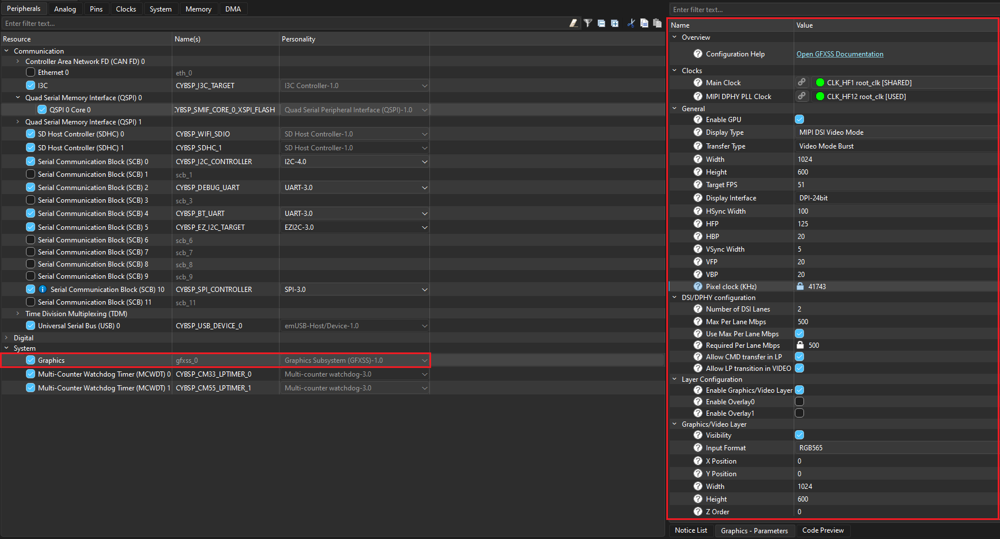

# Waveshare 7-inch Raspberry Pi DSI C display driver library for ModusToolbox&trade;

## Overview

This is the driver library for [Waveshare 7-inch Raspberry Pi DSI LCD C Display](https://www.waveshare.com/7inch-dsi-lcd-c.htm) interfaced to PSOC&trade; Edge E84 Evaluation Kit.

## Quick start

Follow these steps to add the driver in an application for PSOC&trade; Edge E84 Evaluation Kit.

1. Create a [PSOC&trade; Edge MCU: Empty application](https://github.com/Infineon/mtb-example-psoc-edge-empty-app) by following "Create a new application" section in [AN235935 – Getting started with PSOC&trade; Edge E8 on ModusToolbox&trade; software](https://www.infineon.com/AN235935) application note

2. Add the *display-dsi-waveshare-7-0-lcd-c* library to this application using Library Manager

3. The Serial Communication Block (SCB) is configured as an I2C controller in the Device Configurator tool as follows:

   - Enable `Serial Communication Block (SCB)` resource and configure the same for display driver in the Device Configurator as shown in the following figure for the project created in **Step 1** <br>

     **Figure 1. SCB I2C master configuration in Device Configurator**

     

4. The graphics subsystem is configured as in the Device Configurator tool as follows:

   - Enable `Graphics` resource and configure the same for display driver in Device Configurator as shown in **Figure 2** the project created in **Step 1**

     **Figure 2. Graphics configuration in Device Configurator**

     

   - Ensure that at least one layer is enabled to render the graphics. For example, in the **Graphics/Video Layer** section, select desired **Input Format** from the list of available options and set **Width** to **1024**, and **Height** to **600** matching to the 7 inch display resolution

   > **Note:** The user shall configure the **Input Format**, **Width**, **Height** and other parameters according to the application requirements. Additionally, the stride must be 128 bytes aligned, so the **Width** should be adjusted accordingly, close to the resolution supported by the display.


5. Save the modified configurations in Device Configurator

6. Use the driver as shown in the following code snippet:

    ```cpp

    #include "cybsp.h"
    #include "mtb_disp_ws7p0dsi_drv.h"
    
    
    /*******************************************************************************
    * Macros
    *******************************************************************************/
    #define I2C_CONTROLLER_IRQ_PRIORITY             (2UL)
    /* I2C instance to be initialized using the Device Configurator in ModusToolbox&trade; software.
     * The term CYBSP_I2C_CONTROLLER_HW refers to the same SCB instance configured as I2C.
     */

    #define BRIGHTNESS_TEST_VALUE                   (245U)
    
    
    /*******************************************************************************
    * Global variables
    *******************************************************************************/
    /* I2C controller context. */
    cy_stc_scb_i2c_context_t i2c_controller_context;
    
    /* I2C IRQ configuration. */
    cy_stc_sysint_t i2c_irq_cfg =
    {
        .intrSrc      = CYBSP_I2C_CONTROLLER_IRQ,
        .intrPriority = I2C_CONTROLLER_IRQ_PRIORITY,
    };
    
    /* Graphics subsystem to be initialized using the Device Configurator in ModusToolbox&trade; software.
     * The term GFXSS refers to the same graphics subsystem instance.
     */
    cy_stc_gfx_context_t gfx_context;
    

    /*****************************************************************************
    * Function name: i2c_interrupt_handler
    ******************************************************************************
    *
    * Invokes the Cy_SCB_I2C_Interrupt() PDL driver function.
    *
    *****************************************************************************/
    void i2c_interrupt_handler(void)
    {
        Cy_SCB_I2C_Interrupt(CYBSP_I2C_CONTROLLER_HW, &i2c_controller_context);
    }

    
    /*****************************************************************************
    * Code
    *****************************************************************************/
    int main(void)
    {
        cy_rslt_t result;
        cy_en_scb_i2c_status_t i2c_result = CY_SCB_I2C_SUCCESS;
        cy_en_sysint_status_t sys_status = CY_SYSINT_SUCCESS;
        cy_en_gfx_status_t gfx_status = CY_GFX_SUCCESS;
    
        /* Initializes the device and board peripherals. */
        result = cybsp_init();
        if (CY_RSLT_SUCCESS != result)
        {
            CY_ASSERT(0);
        }

        /* Enables global interrupts. */
        __enable_irq();
    
        /* GFXSS init. */
        /* MIPI-DSI display-specific configurations. */
        GFXSS_config.mipi_dsi_cfg = &mtb_disp_ws7p0dsi_dsi_config;

        /* Initializes the graphics system. */
        gfx_status = Cy_GFXSS_Init(GFXSS, &GFXSS_config, &gfx_context);
    
        if (CY_GFX_SUCCESS == gfx_status)
        {
            /* Clears GPU interrupt. */
            Cy_GFXSS_Clear_GPU_Interrupt(GFXSS, &gfx_context);
    
            /* Initializes the I2C in master mode. */
            i2c_result = Cy_SCB_I2C_Init(CYBSP_I2C_CONTROLLER_HW,
                                        &CYBSP_I2C_CONTROLLER_config, &i2c_controller_context);
    
            if (CY_SCB_I2C_SUCCESS != i2c_result)
            {
                CY_ASSERT(0);
            }
    
            /* Initializes the I2C interrupt. */
            sys_status = Cy_SysInt_Init(&i2c_irq_cfg,
                                        &i2c_interrupt_handler);
    
            if (CY_SYSINT_SUCCESS != sys_status)
            {
                CY_ASSERT(0);
            }
    
            /* Enables the I2C interrupts. */
            NVIC_EnableIRQ(i2c_irq_cfg.intrSrc);

            /* Enables the I2C. */
            Cy_SCB_I2C_Enable(CYBSP_I2C_CONTROLLER_HW);
    
            /* Initializes the display. */
            result = mtb_disp_ws7p0dsi_panel_init(CYBSP_I2C_CONTROLLER_HW,
                                                    &i2c_controller_context);
    
            if (CY_RSLT_SUCCESS != result)
            {
                CY_ASSERT(0);
            }
    
            /* Displays graphics frame as per application use case, an example shown in
            * below comment, assume img_ptr holds the image frame.
            */
            /*
            *   Cy_GFXSS_Set_FrameBuffer((GFXSS_Type*) GFXSS, (uint32_t*) img_ptr,
            *                            &gfx_context);
            */

            /* Brightness control of the display panel. */
            result = mtb_disp_ws7p0dsi_panel_brightness_ctrl(CYBSP_I2C_CONTROLLER_HW,
                                                            &i2c_controller_context,
                                                            BRIGHTNESS_TEST_VALUE);
    
            if (CY_RSLT_SUCCESS != result)
            {
                CY_ASSERT(0);
            }

            /* De-initializes the display. */
            result = mtb_disp_ws7p0dsi_panel_deinit(CYBSP_I2C_CONTROLLER_HW,
                                                    &i2c_controller_context);
    
            if (CY_RSLT_SUCCESS != result)
            {
                CY_ASSERT(0);
            }

        }
    
        for (;;)
        {
        }
    }
    ```


## More information

For more information, see the following documents:

* [API reference guide](./API_reference.md)
* [ModusToolbox&trade; software environment, quick start guide, documentation, and videos](https://www.infineon.com/modustoolbox)
* [AN239191](https://www.infineon.com/AN239191) – Getting started with graphics on PSOC&trade; Edge MCU
* [Infineon Technologies AG](https://www.infineon.com)


---
© 2025, Cypress Semiconductor Corporation (an Infineon company)
