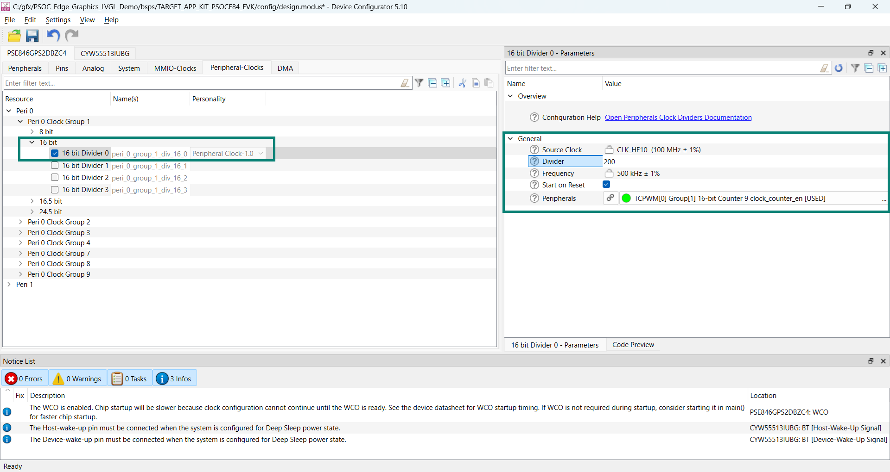
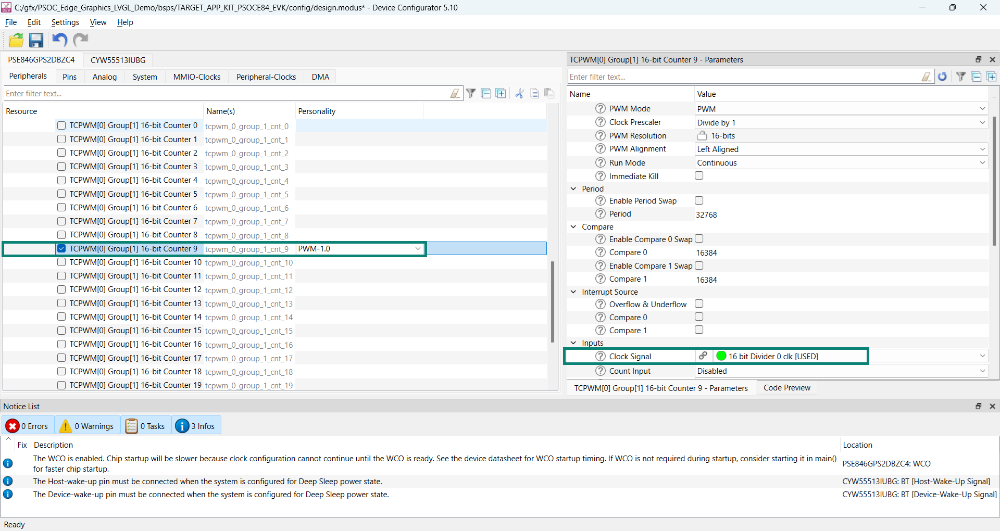
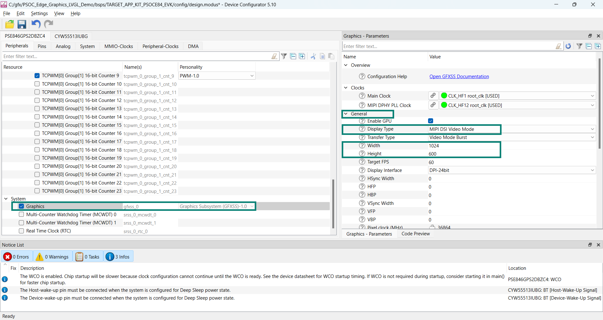
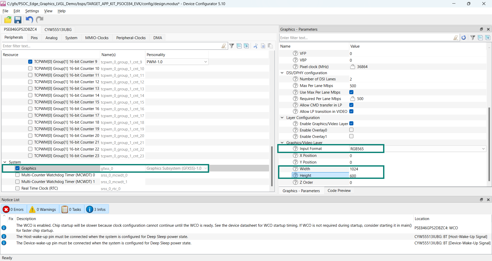

# EK79007AD3 TFT DSI display driver library for ModusToolbox&trade;

## Overview

This driver library is designed to support 10.1 inch MIPI DSI TFT LCD, model [WF101JTYAHMNB0](https://www.winstar.com.tw/products/tft-lcd/ips-tft/ips-touch.html). Equipped with the [EK79007AD3](https://www.crystalfontz.com/controllers/datasheet-viewer.php?id=505) display controller, this LCD offers a resolution of 1024x600 pixel, ensuring high-quality visual performance. 

The following PSOC&trade; Edge E84 Evaluation Kits support this 10.1 inch MIPI DSI TFT LCD:
- [PSOC&trade; Edge E84 Evaluation Kit](https://www.infineon.com/KIT_PSE84_EVAL) (`KIT_PSE84_EVAL_EPC2`) 
- [PSOC&trade; Edge E84 Evaluation Kit](https://www.infineon.com/KIT_PSE84_EVAL) (`KIT_PSE84_EVAL_EPC4`)

## Quick start

Follow these steps to add the driver in an application for PSOC&trade; Edge E84 Evaluation Kit.

1. Create a [PSOC&trade; Edge MCU: Empty application](https://github.com/Infineon/mtb-example-psoc-edge-empty-app) by following "Create a new application" section in [AN235935 – Getting started with PSOC&trade; Edge E8 on ModusToolbox&trade; software](https://www.infineon.com/AN235935) application note

2. Add the *display-tft-ek79007ad3* library to this application using Library Manager

3. Use Device Configurator to configure **Timer, counter, and pulse width modulator (TCPWM)** block for display backlight control in the application as follows:

   - Enable and configure a 16-bit peripheral clock divider as highlighted in the following figure
        
     **Figure 1. Peripheral clock configuration**
            
     

   - Following the previous step, enable the TCPWM block linked to the backlight pin in PWM mode with default values. Finally, choose the clock set up in the preceding step as the input to this block, as shown in **Figure 2**. You do not need to configure the TCPWM block, as the driver provides the default configuration through an external variable. You can directly pass this variable to the backlight `init` function as shown in the following figure
    
     **Figure 2. TCPWM peripheral configuration**
            
     

4. Set up the **Graphics** resource in Device Configurator for the 10.1 inch display as follows:

   - In the **General** section, set **Display Type** to **MIPI DSI Video Mode**, **Width** to **1024**, and **Height** to **600**. Keep default values for the remaining parameters as highlighted in the following figure
      
     **Figure 3. Graphics subsystem - display controller configuration**
      
     

   - Ensure that at least one layer is enabled to render the graphics. For example, in the **Graphics/Video Layer** section,  select desired **Input Format** from the list of available options and set **Width** to **1024**, and **Height** to **600** matching to the 10.1 inch display resolution. 
        
     **Figure 4. Graphics subsystem - video layer configuration**
      
     

     Similarly, other layers can be configured based on application requirement

   > **Note:** The user shall configure the **Input Format**, **Width**, **Height** and other parameters according to the application requirements. Additionally, the stride must be 128 bytes aligned, so the **Width** should be adjusted accordingly, up to the resolution supported by the display. For example, stride = width * bytes per pixel (1024 * 2) in the case of a 16-bit color format

5. Save the modified configuration(s) in Device Configurator

6. Enable **GFXSS** by adding it to the project's Makefile `COMPONENTS` list or in the *common.mk* file:
   ```
   COMPONENTS+=GFXSS
   ```
 
7. Use the driver APIs in the application as shown in the following code snippet:
    ```cpp
    #include "cybsp.h"
    #include "mtb_display_ek79007ad3.h"


    /*****************************************************************************
    * Macros
    *****************************************************************************/
    /* These pins can be configured as per the schematics in Device Configurator. */
    #define DISP_RESET_PORT      GPIO_PRT20
    #define DISP_RESET_PIN       (7U)

    #define BACKLIGHT_PORT       GPIO_PRT20
    #define BACKLIGHT_PIN        (6U)
    #define BRIGHTNESS_PERCENT   (70U)


    /*****************************************************************************
    * Global variable(s)
    *****************************************************************************/
    cy_stc_gfx_context_t gfx_context;

    mtb_display_ek79007ad3_pin_config_t ek79007ad3_pin_cfg =
    {
        .reset_port = DISP_RESET_PORT,
        .reset_pin  = DISP_RESET_PIN,
    };

    mtb_display_ek79007ad3_backlight_config_t ek79007ad3_backlight_cfg =
    {
        .bl_port    = BACKLIGHT_PORT,
        .bl_pin     = BACKLIGHT_PIN,
        .pwm_hw     = TCPWM0,
        .pwm_num    = tcpwm_0_group_1_cnt_9_NUM,
        .pwm_config = &mtb_display_ek79007ad3_backlight_pwm_config,
    };


    /*****************************************************************************
    * Function name: main
    *****************************************************************************/
    int main(void)
     {
        cy_rslt_t result;
        cy_en_gfx_status_t gfx_status = CY_GFX_BAD_PARAM;

        /* Initializes the device and board peripherals. */
        result = cybsp_init();
        if (CY_RSLT_SUCCESS != result)
        {
            CY_ASSERT(0);
        }

        /* Enables global interrupts. */
        __enable_irq();

        /* MIPI-DSI display-specific configurations
         * If the video timings for the panel are configured using Device 
         * Configurator as shown in steps above then this is optional.
         */
        GFXSS_config.mipi_dsi_cfg = &mtb_display_ek79007ad3_mipidsi_config;

        /* Initializes the graphics system according to the configuration. */
        gfx_status = Cy_GFXSS_Init(GFXSS, &GFXSS_config, &gfx_context);

        if (CY_GFX_SUCCESS == gfx_status)
        {
            /* Initializes EK79007AD3 10.1 inch display driver. */
            if (CY_MIPIDSI_SUCCESS !=
                mtb_display_ek79007ad3_init(GFXSS_GFXSS_MIPIDSI, &ek79007ad3_pin_cfg))
            {
                /* Handles possible errors. */
                CY_ASSERT(0);
            }

            /* Initializes 10.1 inch display backlight. */
            if (CY_TCPWM_SUCCESS != 
                mtb_display_ek79007ad3_backlight_init(&ek79007ad3_backlight_cfg))
            {
                /* Handles possible errors. */
                CY_ASSERT(0);
            }

            /* Renders a graphics frame on the display as per application use case. 
            * An example of sending a graphics frame to the display is shown below,
            * assuming img_ptr holds the image frame.
            */

            Cy_GFXSS_Set_FrameBuffer((GFXSS_Type*) GFXSS, (uint32_t*) img_ptr,
                                    &gfx_context);
            /* Performs application-specific task. */       
        }

        for (;;)
        {
        }
    }
    ```
    ```cpp
    /* Calls this API from anywhere in the application code to set 
    * display brightness once backlight initialization is complete. 
    */
    mtb_display_ek79007ad3_set_brightness(BRIGHTNESS_PERCENT);

    /* De-initializes the display before releasing all the resources. */
    mtb_display_ek79007ad3_deinit(GFXSS_GFXSS_MIPIDSI);
    ```
  
## More information

For more information, see the following documents:

* [API reference guide](./API_reference.md)
* [ModusToolbox&trade; software environment, quick start guide, documentation, and videos](https://www.infineon.com/modustoolbox)
* [AN239191](https://www.infineon.com/AN239191) – Getting started with graphics on PSOC&trade; Edge MCU
* [Infineon Technologies AG](https://www.infineon.com)


---
© 2025, Cypress Semiconductor Corporation (an Infineon company)
