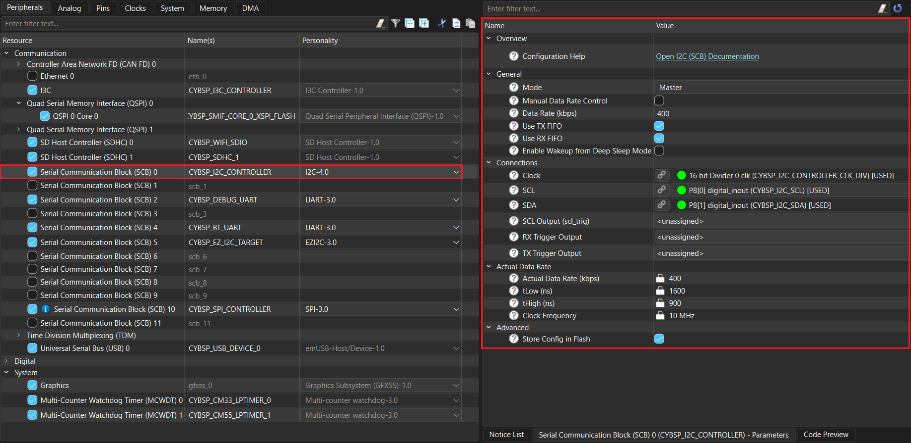

# GT911 touch panel driver library for ModusToolbox&trade;

## Overview

This is the driver library for GT911 capacitive sensing touch panel.

Touch Controller: [GT911](https://www.crystalfontz.com/controllers/GOODIX/GT911/)

## Quick start

Follow these steps to add the driver in an application for PSOC&trade; Edge E84 Evaluation Kit.

1. Create a [PSOC&trade; Edge MCU: Empty application](https://github.com/Infineon/mtb-example-psoc-edge-empty-app) by following "Create a new application" section in [AN235935 – Getting started with PSOC&trade; Edge E8 on ModusToolbox&trade; software](https://www.infineon.com/AN235935) application note

2. Add this *touch-ctp-gt911* library to the application using Library Manager

3. The Serial Communication Block (SCB) is configured as an I2C controller in the Device Configurator tool as follows:

   - Enable Serial Communication Block (SCB) resource and configure the same for GT911 in Device Configurator as shown below for the project created in **Step 1**

     **Figure 1. SCB I2C controller configuration in Device Configurator**

     

4. Save the modified configuration in Device Configurator

5. Use the driver as shown in the following code snippet:

    ```cpp
    #include "cybsp.h"
    #include "mtb_ctp_gt911.h"
    
    
    /*******************************************************************************
    * Macros
    *******************************************************************************/
    #define I2C_CONTROLLER_IRQ_PRIORITY             (2UL)
    
    
    /*******************************************************************************
    * Global variables
    *******************************************************************************/
    /* I2C controller context. */
    cy_stc_scb_i2c_context_t i2c_controller_context;
    
    /* I2C IRQ configuration. */
    cy_stc_sysint_t i2c_irq_cfg =
    {
        .intrSrc = CYBSP_I2C_CONTROLLER_IRQ,
        .intrPriority = I2C_CONTROLLER_IRQ_PRIORITY,
    };

    /*******************************************************************************
    * Code
    *******************************************************************************/
    int main(void)
    {
        cy_rslt_t result;
        cy_en_scb_i2c_status_t i2c_result = CY_SCB_I2C_SUCCESS;
        cy_en_sysint_status_t sys_status = CY_SYSINT_SUCCESS;

        int x = 0;
        int y = 0;

        /* Initializes the device and board peripherals */
        cybsp_init();

        /* Enables global interrupts. */
        __enable_irq();

            /* Initializes the I2C in controller mode. */
            i2c_result = Cy_SCB_I2C_Init(CYBSP_I2C_CONTROLLER_HW,
                                        &CYBSP_I2C_CONTROLLER_config, &i2c_controller_context);
    
            if (CY_SCB_I2C_SUCCESS != i2c_result)
            {
                CY_ASSERT(0);
            }
    
            /* Initializes the I2C interrupt. */
            sys_status = Cy_SysInt_Init(&i2c_irq_cfg,
                                        &i2c_interrupt_handler);
    
            if (CY_SYSINT_SUCCESS != sys_status)
            {
                CY_ASSERT(0);
            }
    
            NVIC_EnableIRQ(i2c_irq_cfg.intrSrc);
    
            /* Enables the I2C. */
            Cy_SCB_I2C_Enable(CYBSP_I2C_CONTROLLER_HW);
    
            /* Initializes GT911 touch driver. */
            result = mtb_gt911_init(CYBSP_I2C_CONTROLLER_HW, &i2c_controller_context);

            if (CY_RSLT_SUCCESS == result)
            {
                /* Reads touch coordinates. */
                result = mtb_gt911_get_single_touch(CYBSP_I2C_CONTROLLER_HW,
                                                            &i2c_controller_context, &x, &y);
    
                if (CY_RSLT_SUCCESS != result)
                {
                    CY_ASSERT(0);
                }
            }

        for (;;)
        {
        }
    }
    ```

## More information

For more information, refer to the following documents:

* [API reference guide](./API_reference.md)
* [ModusToolbox&trade; software environment, quick start guide, documentation, and videos](https://www.infineon.com/modustoolbox)
* [AN239191](https://www.infineon.com/AN239191) – Getting started with graphics on PSOC&trade; Edge MCU
* [Infineon Technologies AG](https://www.infineon.com)


---
© 2025, Cypress Semiconductor Corporation (an Infineon company)